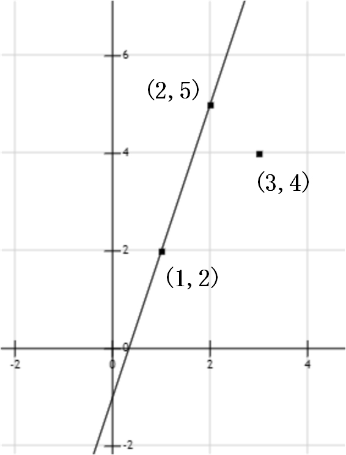

# Problem D

## Title
苗童大作战之愤怒的小鸟

## Description
继愤怒的小鸟N.0版本之后，系统又推出了愤怒的小鸟(N+1).0版。

在最新版中，系统给出了 n 个可供选择的点。苗苗和童童已经是大学生了，运用所学知识，她们很机智的选择了使用平面直角坐标系来表示这些点。她们可以在这 n 个位置中任选两个，一个用于架设支架，一个用于放置小鸟。

现给出这 n 个点的坐标，在击打力度和鸟的种类均相同的条件下，求小鸟和支架可能组成的斜率最大值。

## Input
第一行输入一个整数 n(1 < n < 1000000) ，代表系统给出 n 个可供选择的点。

接下来的 n 行，每行输入两个整数x,y(1 < x, y < 1000000)，分别代表该点的横纵坐标，保证输入按照横坐标递增，且不存在横坐标相同的点。

## OutPut
输出一个数，代表可能组成的仰角正切值的最大值，结果保留两位小数。

## Sample InPut
3  
1 2  
2 5  
3 4  

## Sample OutPut
3.00

## Hint

