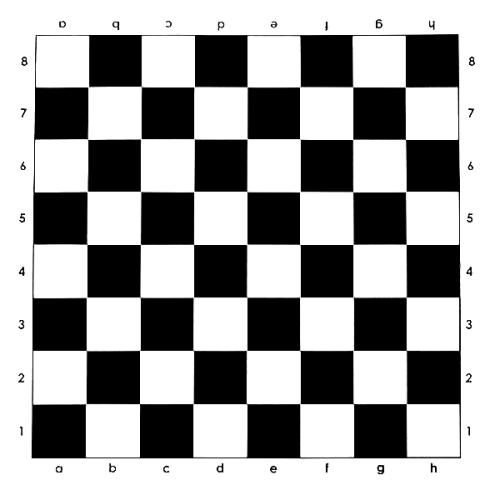

# Problem E

## Title
苗童大作战之开心农场

## Description
童童和苗苗最近迷上了开心农场，可是苗苗总是偷童童的菜，愤怒的童童现在要进行反击了！！！

苗苗的农场是一块无限大的矩形土地（如下图），其黑色部分都被种上了值钱的黑凤梨，白色部分都种上了颜值爆表的猴赛雷。爱美的童童决定选择一个矩形区域偷走其中的猴赛雷。

苗苗的农场（左下角坐标为（1，1））如下：

白色部分与黑色部分都是 1 * 1 的正方形。

童童已经做好了计划，现在她给出了她要偷的矩形区域的左下角点的坐标和右上角点的坐标，现在她想请你帮忙计算一下，她能偷走多少块土地的猴赛雷。

## Input
第一行输入两个整数Px1和Py1，分别代表左下角点的横坐标和纵坐标。

第二行输入两个整数Px2和Py2，分别代表右上角点的横坐标和纵坐标。

## Output
输出一个整数，代表指定的矩形区域中总共有多少块种猴赛雷的土地。

## Sample Input
2 2  
4 4

## Sample Output
4

## Hint

