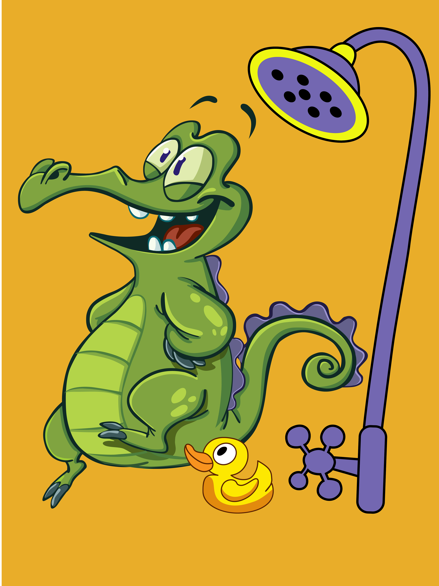
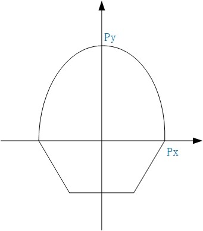

# Problem F

## Title
苗童大作战之爱洗澡的鳄鱼

## Description
童童和苗苗准备邀请小鳄鱼来观看大作战，可是小鳄鱼是出了名的爱洗澡，没有游泳池是请不到小鳄鱼的哟！于是童童和苗苗准备比比谁先请到小鳄鱼，为了公平起见，苗苗和童童画出的泳池底长必须相同。

童童画了一个弧状的游泳池，而苗苗把正六边形的一半用来当作游泳池，可是小鳄鱼觉得洗澡的地方越大越好，那么问题来了，你能告诉小鳄鱼这两个图形的面积吗？

如下图:

x轴上方是童童画的游泳池，为了好看童童用某二元一次方程 y = ax^2 + c 的一部分画出了这段弧，给你二次函数与 x 轴的交点 Px 的绝对值和二次函数与 y 轴的交点 Py, 你能告诉小鳄鱼x轴上方和x轴下方的图形面积吗? 

## Input
输入两个数 Px 和 Py (0 < Px, Py < 10000)

## Output
输出两个数，分别代表 x 轴上方的图形面积和 x 轴下方的图形面积。(保留两位小数)

## Simple input
2 4

## Simple output
10.67 5.20
